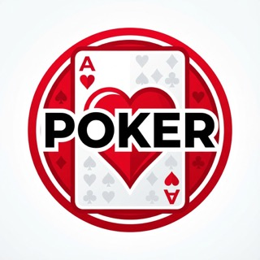

# Texas Hold'em Poker Frontend

<p align="center">
  
</p>

A Texas Hold'em poker game frontend application built with Vue 3 + Vite, featuring complete game functionality and excellent user experience.

## Features

- **User Authentication System**: Support for registration and login functionality
- **Room Management**: Create and join game rooms
- **Real-time Gameplay**: Complete Texas Hold'em poker game logic
- **Real-time Communication**: WebSocket support for real-time game state synchronization
- **Chat System**: Real-time chat functionality within rooms
- **AI Assistance**: Intelligent hand strength analysis and recommended actions
- **Responsive Design**: Adapted for mobile devices with different screen sizes

## Tech Stack

- **Vue 3**: Using Composition API and `<script setup>`
- **Vite**: Fast frontend build tool
- **Pinia**: State management
- **Vue Router**: Routing management
- **Vant**: Mobile UI component library
- **Axios**: HTTP requests
- **WebSocket**: Real-time communication

## Project Structure

```
src/
├── api/           # API request encapsulation
├── assets/        # Static resources
├── components/    # Components
├── plugins/       # Plugin configurations
├── router/        # Router configurations
├── stores/        # State management
├── views/         # Page components
├── App.vue        # Root component
├── main.js        # Entry file
└── style.css      # Global styles
```

## Installation and Running

### Install Dependencies

```bash
npm install
```

### Run in Development Environment

```bash
npm run dev
```

### Build for Production Environment

```bash
npm run build
```

## Core Functionality

### User Authentication
- Support for username/email registration
- Password encrypted storage
- JWT authentication mechanism

### Game Rooms
- Create rooms with customizable parameters like blinds and player count
- Browse and join existing rooms
- Real-time room status updates

### Game Logic
- Complete Texas Hold'em poker game flow
- Player actions (Fold, Call, Raise, All-in)
- Hand settlement and chip distribution

### Real-time Communication
- Game state real-time synchronization using WebSocket
- Instant player action broadcasting
- Room chat functionality

### AI Assistance
- Hand strength analysis
- Winning probability calculation
- Action recommendations
- Real-time analysis toggle control

## Mobile Adaptation

The application adopts responsive design, mainly adapting to the following sizes:
- Desktop: 1024px and above
- Tablet: 768px - 1024px
- Mobile: 480px and below

## License

MIT License

Copyright (c) 2023 Texas Hold'em Poker Frontend

Permission is hereby granted, free of charge, to any person obtaining a copy
of this software and associated documentation files (the "Software"), to deal
in the Software without restriction, including without limitation the rights
to use, copy, modify, merge, publish, distribute, sublicense, and/or sell
copies of the Software, and to permit persons to whom the Software is
furnished to do so, subject to the following conditions:

The above copyright notice and this permission notice shall be included in all
copies or substantial portions of the Software.

THE SOFTWARE IS PROVIDED "AS IS", WITHOUT WARRANTY OF ANY KIND, EXPRESS OR
IMPLIED, INCLUDING BUT NOT LIMITED TO THE WARRANTIES OF MERCHANTABILITY,
FITNESS FOR A PARTICULAR PURPOSE AND NONINFRINGEMENT. IN NO EVENT SHALL THE
AUTHORS OR COPYRIGHT HOLDERS BE LIABLE FOR ANY CLAIM, DAMAGES OR OTHER
LIABILITY, WHETHER IN AN ACTION OF CONTRACT, TORT OR OTHERWISE, ARISING FROM,
OUT OF OR IN CONNECTION WITH THE SOFTWARE OR THE USE OR OTHER DEALINGS IN THE
SOFTWARE.
